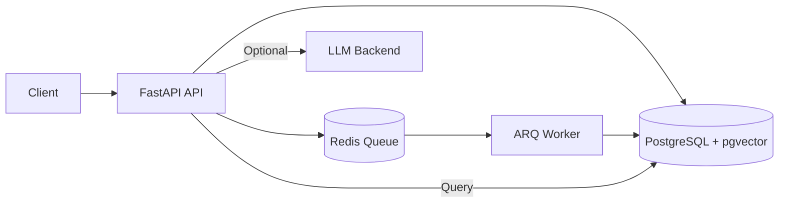
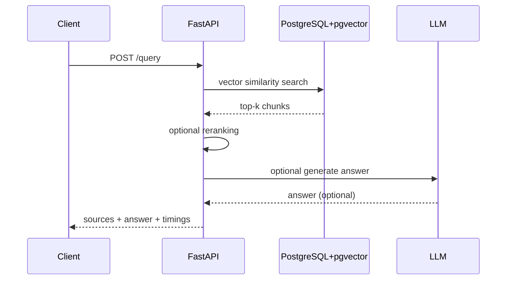
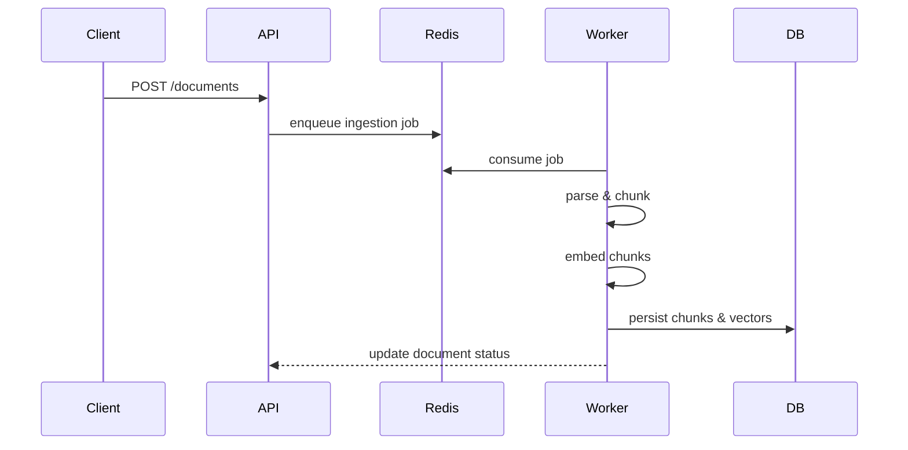

# LLM RAG Service — Production-Grade Retrieval-Augmented Generation Backend

A production-oriented Retrieval-Augmented Generation (RAG) backend service built with FastAPI, PostgreSQL + pgvector, Redis + ARQ, and strict backend engineering practices.

This service is designed as a real-world backend system: async-first, retrieval-first, observable, deterministic by default, and scalable by architecture.

---

## Key Highlights

- Retrieval-first architecture (LLM is optional, never required)
- Vector search in PostgreSQL using pgvector (cosine similarity)
- Async ingestion pipeline via Redis + ARQ workers
- Deterministic local & CI execution (mock embeddings, stub LLM)
- Strict backend discipline: typing, linting, testing, migrations
- Explicit observability: request IDs, structured logs, timings
- Performance-aware design with benchmarks and EXPLAIN plans

---

## High-Level Architecture



---

## RAG Query Pipeline

Retrieval-first pipeline (LLM is optional):

1. Embed user question
2. Vector similarity search in pgvector
3. Candidate selection
4. Optional reranking
5. Context construction
6. Optional LLM answer generation
7. Always return sources with relevance scores

---

## Query Sequence Diagram



---

## Ingestion Pipeline

1. Client uploads document
2. API enqueues ingestion task to Redis
3. ARQ worker processes ingestion:
   - parse document
   - chunk text
   - generate embeddings
   - persist chunks and vectors
4. Document status transitions:
   uploaded → processing → ready / failed

---

## Ingestion Sequence Diagram



---

## Environment Configuration

### Default Mode (No External APIs)

```env
APP_EMBEDDINGS_BACKEND=mock
APP_LLM_BACKEND=disabled
APP_RERANK_BACKEND=stub
APP_RERANK_ALPHA=0.7
```

This mode:
- Requires no API keys
- Is fully deterministic
- Suitable for local development and CI
- Always returns retrieval results

### Enabling OpenAI (Optional)

```env
APP_EMBEDDINGS_BACKEND=openai
APP_LLM_BACKEND=openai
OPENAI_API_KEY=your_api_key
```

LLM usage is optional and isolated. If OpenAI is unavailable, the system falls back to retrieval-only mode.

---

## Observability

- X-Request-Id propagation across API, workers, logs
- Structured JSON logging
- Per-stage timing metrics:
  - embed_query_ms
  - vector_search_ms
  - rerank_ms
  - llm_ms
  - total_ms

This makes performance characteristics explicit and measurable.

---

## Benchmarks

The bench/ directory contains:
- Query payloads
- SQL EXPLAIN ANALYZE plans
- Load test results

Example load test:

```bash
hey -n 200 -c 20 -m POST -T application/json \
  -D bench/query.json \
  http://127.0.0.1:8000/api/v1/query
```

---

## Code Quality & Tooling

- ruff (linting & formatting)
- mypy (strict typing)
- pytest
- pre-commit hooks
- alembic migrations

---

## Architectural Decision Records (ADR)

### ADR-001: Retrieval-First Design

Decision:
The system always performs retrieval and returns sources, regardless of LLM availability.

Rationale:
- Guarantees correctness and explainability
- Prevents outages caused by external LLM dependencies
- Enables deterministic CI and local execution

---

### ADR-002: PostgreSQL + pgvector Instead of External Vector DB

Decision:
Use PostgreSQL with pgvector instead of a dedicated vector database.

Rationale:
- Operational simplicity
- Strong transactional guarantees
- Easier schema evolution
- Sufficient performance for most workloads

---

### ADR-003: Async Ingestion via Redis + ARQ

Decision:
Decouple ingestion from request path using background workers.

Rationale:
- Non-blocking uploads
- Horizontal scalability
- Clear failure isolation
- Retry and backoff support

---

### ADR-004: Optional LLM Integration

Decision:
Treat LLMs as an enhancement, not a dependency.

Rationale:
- Core value is retrieval quality
- LLM availability and cost are unpredictable
- Enables graceful degradation

---

## Project Structure

```text
app/
  api/            FastAPI routes
  core/           settings, logging, middleware
  db/             database engine & migrations
  infra/          Redis, storage integrations
  rag/            ingestion, retrieval, rerank, LLM logic
  repos/          database repositories
  workers/        ARQ background workers
bench/            benchmarks and performance artifacts
docs/             architecture diagrams
tests/            automated tests
```

---

## Design Principles

- Retrieval-first architecture
- Async everywhere
- Explicit failure handling
- Deterministic execution
- Performance awareness
- Clear separation of concerns

---

## Final Notes

LLM integration is intentionally optional.

The system prioritizes correctness, reliability, and performance of retrieval and ingestion pipelines, with LLMs treated as an enhancement rather than a dependency.
